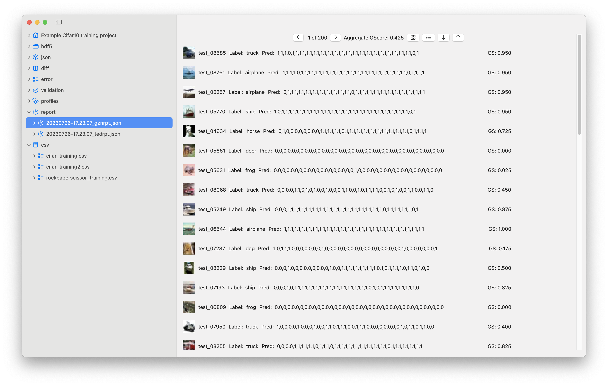
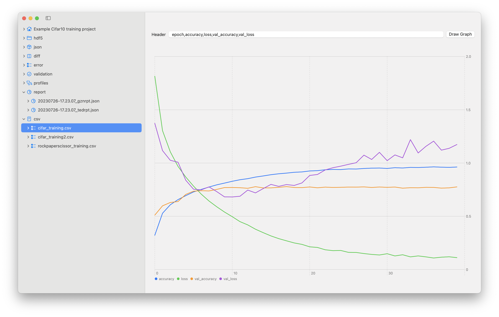

# poqet ai: 

Issue tracking and documentation for poqet ai and poqet ai lite.

## About poqet ai
poqet ai is a visualization and debugging tool for machine learning models. 

## About poqet ai lite
lite is a free MacOS app for machine learning development. It provides a subset of features in poqet ai. The lite version doesn't have the debugging or model visualization features. To signup for poqet ai beta program, please visit the link https://www.giild.com/

## Feature Table

| Feature                              | poqet ai | lite |
|--------------------------------------|----------|------|
| accuracy & loss chart                | v1 beta  | X    |
| test dataset results                 | v1 beta  | X    |
| search and filter test results       | v1 beta  | X    |
| record prediction for all epochs     | v1 beta  | X    |
| create accuracy & loss chart for csv | v1 beta  | X    |
| heatmap of model weights             | v1 beta  |      |
| heatmap of diff between epochs       | v1 beta  |      |
| heatmap of layer activations         | v1 beta  |      |
| heatmap of diff between activations  | v1 beta  |      |
| avg the weight of 2 epochs           | v1 beta  |      |
| compare weights of any 2 epochs      | v1 beta  |      |
| execute python scripts from app      | v1 beta  |      |
| visualize model graph                | v2       |      |
| support pytorch model                | v2       |      |
| support ONNX model                   | v2       |      |
| models greater than 15M parameters   | v3       |      |

### Documentation

For the complete documentation, please visit the wiki

https://github.com/giild/poqetaiApp/wiki

### Heatmap

Visualize the parameter changes between checkpoint models. When the model overfits to the training dataset, visualizing the parameter changes between epochs can help identify which weights contribute to regression.

### Profile and debug bad predictions

Visualize the layer activations with heatmaps to get a better understanding why predictions are wrong. Identify common patterns in prediction errors by comparing the output activations.

### View Dataset Results

View the prediction for the test dataset with thumbnails and quickly identify which records had errors. Search and filter the errors to identify common patterns causing prediction failtures.

View the prediction for each image for the entire training session. Bad prediction is zero and correct is 1. In a well generalized model, the predictions may start out with bad prediction and gradually get better. If the predictions are all zeros, it means the model never got it correct. If the model got it right in the middle of the training, but then ended up with zeros, it means the model overfit to the training data.

### Accuracy & Loss Chart

Accuracy and loss chart for the training session.

### CSV charts

If your python script saves the accuracy and loss for the training session, you can easily render the data in a line chart. The app expects the first column to be the epoch and the remaining columns the accuracy and loss.

## Where to get poqet ai
During the beta testing period, you can signup for the beta program https://www.giild.com/

## Issue Guidelines
We value feedback and want to hear you. Please review the issues guidelines before submitting a new issue. This helps us manage and prioritize the issues. It also helps users search the issues and get the information quickly.

### Etiquette

We value honest feedback and it's critical for the long term health of the application. 

1. avoid name calling and shouting with all caps
2. avoid profanity or NSFW
3. avoid hijacking other people's issue tickets

### Bugs

1. Include system and build information
2. Include any errors or relevant logs
3. If you can provide a repeatable test case, please attach it to the issue or provide a link to download the material
4. Include a description of the steps to reproduce the bug

### Feature Request

1. Provide a detailed description of the feature
2. Explain why you feel it would be useful
3. Include any screencaps or mockups that might help us prioritize the feature

### General Feedback

1. Anything that isn't a bug or feature request is considered general feedback
2. Questions about documentation
3. Questions about product roadmap
   
